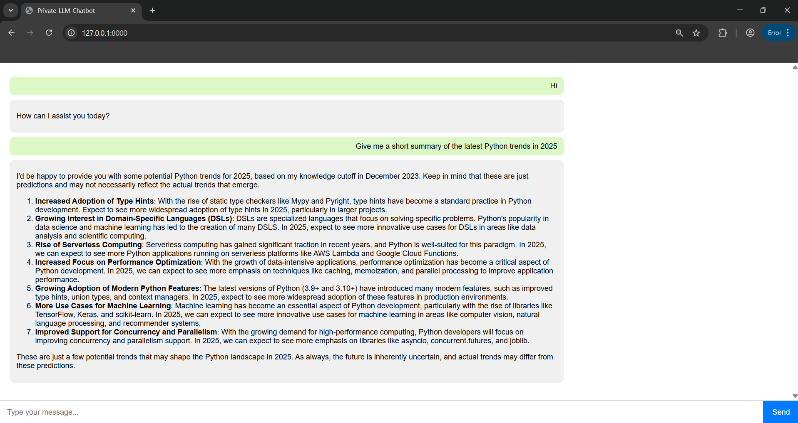

# Local LLM Chatbot

A AI assistant built with **Django** and **Ollama**, powered by **LLaMA 3.2**. The goal for this project is to replicate  ChatGPT-like experience locally — entirely offline and private.

---

## Prerequisites

- Python 3.x installed
- [Ollama](https://ollama.com) installed and running locally
  - Make sure you have downloaded a model (e.g., `llama3.2`) using:
    ```
    ollama pull llama3.2
    
    ```
  - Start the Ollama server in a separate terminal:
    ```
    ollama serve
    ```

- Recommended: Create and activate a Python virtual environment


## ⚡ Key Features

✅ ChatGPT-like web UI  
✅ Local Ollama server using LLaMA 3.2  
✅ 100% private — no external API keys  
✅ Django-powered backend  


---

## 📚 Tech Stack

- **Backend:** Django 5.x (Python 3.11)
- **LLM:** Ollama + LLaMA 3.2
- **Frontend:** HTML, CSS, JavaScript (Vanilla JS)
- **API Endpoint:** `http://localhost:11434/api/chat`

---

## 🧩 How to Run Locally

1️⃣ **Clone the repo**
```bash
git clone https://github.com/karthik0967/Local-LLM-Chatbot.git
cd Local-llm-chatbot
```

2️⃣ **Create a virtual environment**
```bash
python -m venv venv
# On Windows:
venv\Scripts\activate
# On macOS/Linux:
source venv/bin/activate
```

3️⃣ **Install Python dependencies**
```bash
pip install -r requirements.txt
```

4️⃣ **Start the Django server**
```bash
cd mychatbot
python manage.py runserver
```

5️⃣ **Run Ollama**
```bash
ollama serve
ollama run llama3.2
```

6️⃣ Open `http://127.0.0.1:8000/` and start chatting!

---

## 🚀 Example Use

Ask questions like:  
> "Give me a summary of the latest Python trends in 2025."  
> "Write a short Django view function."

And the assistant will respond with formatted, relevant answers.

---

## 💬 Chatbot UI

Here’s what the chatbot looks like:



---

## ✍️ Author

Karthik 
